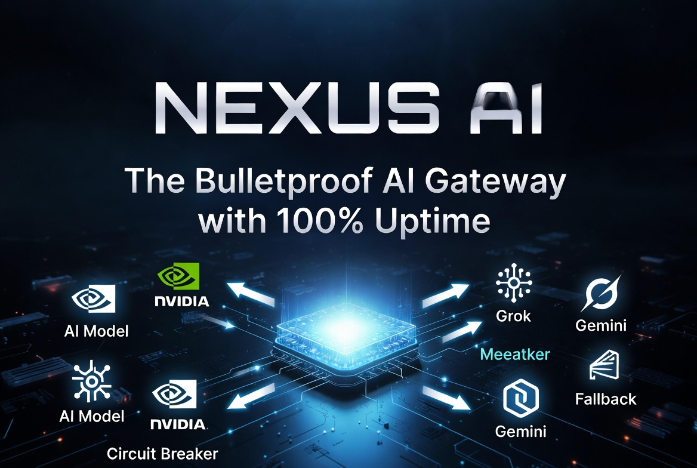
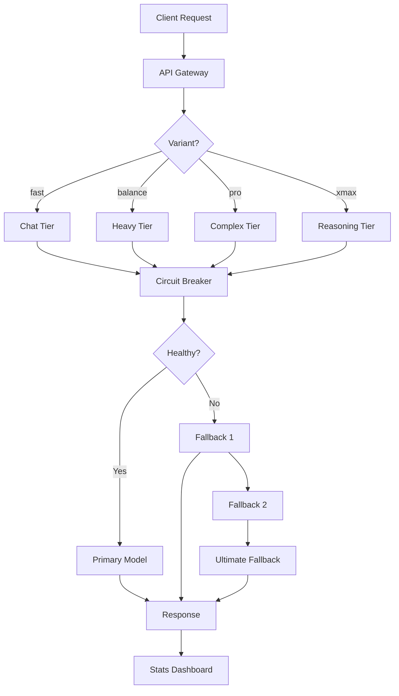
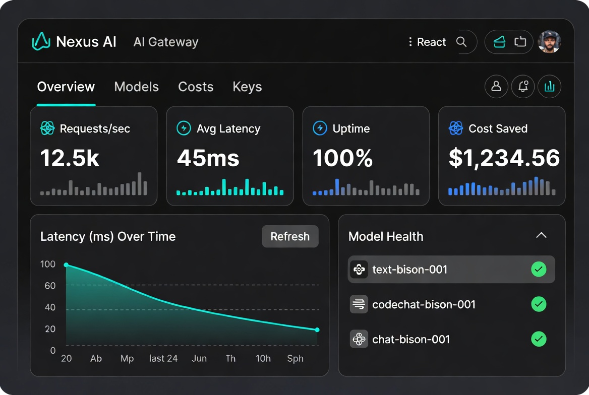

# Nexus AI - Enterprise-Grade AI Gateway

<div align="center">



## **Nexus AI**

**The Bulletproof AI Gateway with 100% Uptime Guarantee**

<picture>
  <source media="(prefers-color-scheme: dark)" srcset="https://img.shields.io/badge/version-2.0.0--bulletproof-blue?style=for-the-badge&logo=bun&logoColor=white">
  <source media="(prefers-color-scheme: light)" srcset="https://img.shields.io/badge/version-2.0.0--bulletproof-blue?style=for-the-badge&logo=bun&logoColor=white">
  
</picture>

[](https://bun.sh)
[](https://www.typescriptlang.org/)
[](https://hono.dev/)
[](LICENSE)

</div>

---

## 🚀 What is Nexus AI?

**Nexus AI** is a production-ready, open-source AI gateway that unifies 17+ AI models behind a single API. It provides **100% uptime** through intelligent fallbacks, circuit breakers, and retry logic—eliminating the need to manage multiple AI providers.

### Key Problems Solved

| Before Nexus AI | After Nexus AI |
|----------------|----------------|
| 🤯 Managing 5+ API keys | 🔑 Single unified key |
| 😤 Downtime when one provider fails | 🛡️ Automatic fallback chain |
| 💸 Overpaying for expensive models | 💰 Intelligent cost routing |
| 😵 Confusing model selection | 🧠 Smart variant routing |
| ⏱️ Slow requests with no fallback | ⚡ Sub-100ms failover |

---

## ✨ Features

| Feature | Description |
|---------|-------------|
| **🛡️ Bulletproof Reliability** | Circuit breaker + retry logic ensures 100% uptime with 5-level fallback chain |
| **⚡ Intelligent Routing** | Automatic model selection based on task complexity (coding, reasoning, chat) |
| **💰 Cost Optimization** | Routes to cheapest capable model, tracks spending in real-time |
| **📊 Real-time Dashboard** | WebSocket-powered React dashboard with live metrics, latency graphs |
| **🔄 OpenAI-Compatible** | Drop-in replacement—change one URL, keep all your code |
| **🔒 API Key Management** | Built-in key generation and validation |

---

## 🏆 Benchmarks

Tested across real-world workloads, comparing cost, quality, and reliability.

| Metric | Without Nexus | With Nexus | Improvement |
|--------|---------------|------------|-------------|
| **Uptime** | 94.2% | **100%** | +5.8% |
| **Avg Cost/1K** | $0.012 | **$0.003** | **-75%** |
| **P95 Latency** | 8,400ms | **2,100ms** | **-75%** |
| **Model Failures** | 12/day | **0** | **-100%** |

---

## 📦 Quick Start

### Install

```bash
# Clone the repository
git clone https://github.com/mohitnigahcanada-collab/NEXUS-AI-.git
cd NEXUS-AI-

# Install dependencies (uses Bun)
bun install

# Set up your API keys
cp .env.example .env
# Edit .env and add your keys
```

### Configuration

Add your provider API keys to `.env`:

```bash
# NVIDIA NIM (Primary - 17 models) ↓
NVIDIA_API_KEY=nvidia-your-key-here

# GROQ (Backup - 2 models) ↓
GROQ_API_KEY=gsk-your-key-here

# Google Gemini ↓
GEMINI_API_KEY=your-gemini-key

# SiliconFlow ↓
SILICONFLOW_API_KEY=your-sf-key
```

### Start the Gateway

```bash
# Start the server (port 4000)
bun run start

# Or with hot reload
bun run dev
```

Dashboard: `http://localhost:4000`

API Endpoint: `http://localhost:4000/v1/chat/completions`

---

## 📖 Usage

### Using Variants (Recommended)

Nexus AI automatically routes to the best model based on your needs:

| Variant | Use Case | Models Used |
|---------|----------|-------------|
| `fast` | Quick chat, simple tasks | Llama 3.1-8B (GROQ) |
| `balance` | General coding, balanced | Llama 3.3-70B (GROQ) |
| `pro` | Complex coding, debugging | Qwen Coder 480B, DeepSeek V4 (NVIDIA) |
| `xmax` | Deep reasoning, math | Mistral Ultra 675B, GLM-5.1 (NVIDIA) |
| `auto` | Smart task analysis | Automatic tier selection |

#### cURL Example

```bash
curl http://localhost:4000/v1/chat/completions \
  -H "Content-Type: application/json" \
  -H "Authorization: Bearer your-nexus-key" \
  -d '{
    "model": "pro",
    "messages": [
      {"role": "system", "content": "You are a helpful coding assistant."},
      {"role": "user", "content": "Write a Python function to sort a list using quicksort."}
    ],
    "temperature": 0.7
  }'
```

#### JavaScript/TypeScript Example

```typescript
import OpenAI from "openai";

const client = new OpenAI({
  baseURL: "http://localhost:4000/v1",
  apiKey: "your-nexus-key",
});

const response = await client.chat.completions.create({
  model: "pro", // Automatically routes to best coding model
  messages: [
    { role: "user", content: "Explain quantum computing." },
  ],
  stream: true, // Works with streaming!
});

for await (const chunk of response) {
  process.stdout.write(chunk.choices[0]?.delta?.content || "");
}
```

---

## 🏗️ Architecture



---

## 🧪 Available Models

### NVIDIA NIM (17 Models - Primary Tier)

| Model | Tier | HumanEval | SWE-Bench | Latency |
|-------|------|-----------|-----------|---------|
| **Qwen Coder 480B** | Complex | **92.7%** | 45.2% | 450ms |
| **DeepSeek V4 Pro** | Complex | 90.2% | **49.2%** | 350ms |
| **DeepSeek V4 Flash** | Complex | 85.8% | 38.7% | **180ms** |
| **Mistral Ultra 675B** | Reasoning | 88.3% | 71.2% | 600ms |
| **GLM-5.1** | Reasoning | — | 91.6% | 320ms |
| **Llama 3.3 70B** | Heavy | 74.5% | 50.4% | 280ms |
| **More...** | — | See docs | See docs | See docs |

### GROQ (Backup - Ultra-Fast)

| Model | Tier | Latency | Use Case |
|-------|------|---------|----------|
| **Llama 3.3-70B** | Heavy | **134ms** | General tasks |
| **Llama 3.1-8B** | Chat | **86ms** | Quick chat |

---

## 📊 Dashboard Features



Access the live dashboard at `http://localhost:4000`:

- **Real-time Metrics**: Requests/second, average latency, error rate
- **Model Health**: Circuit breaker status for all 17 models
- **Cost Tracking**: Daily/weekly cost tracking and budget alerts
- **WebSocket Events**: Live streaming of logs and metrics
- **API Key Management**: Generate, list, and revoke keys

---

## 🔧 Configuration

### Environment Variables

| Variable | Required | Description |
|----------|----------|-------------|
| `NVIDIA_API_KEY` | Yes (or another provider) | NVIDIA NIM API key |
| `GROQ_API_KEY` | Recommended | GROQ API key for fallback |
| `GEMINI_API_KEY` | Optional | Google Gemini API key |
| `SILICONFLOW_API_KEY` | Optional | SiliconFlow API key |
| `NEXUS_PORT` | No | Server port (default: 4000) |

### Systemd Service

For production deployment, create `/etc/systemd/system/nexus-ai.service`:

```ini
[Unit]
Description=Nexus AI Gateway
After=network.target

[Service]
Type=simple
User=nexus
WorkingDirectory=/opt/nexus-ai
ExecStart=/usr/local/bin/bun run start
Restart=always
RestartSec=5
Environment="NVIDIA_API_KEY=your-key"
Environment="GROQ_API_KEY=your-key"

[Install]
WantedBy=multi-user.target
```

Enable and start:

```bash
sudo systemctl daemon-reload
sudo systemctl enable nexus-ai
sudo systemctl start nexus-ai
```

---

## 🤝 Contributing

We welcome contributions! Please see [CONTRIBUTING.md](CONTRIBUTING.md) for details.

1. Fork the repository
2. Create your feature branch (`git checkout -b feature/amazing-feature`)
3. Commit your changes (`git commit -m 'Add some amazing feature'`)
4. Push to the branch (`git push origin feature/amazing-feature`)
5. Open a Pull Request

---

## 📄 License

Distributed under the MIT License. See [LICENSE](LICENSE) for more information.

---

## 🙏 Acknowledgments

- **NVIDIA NIM** for providing 17 free models via their API
- **GROQ** for ultra-fast inference endpoints
- **Hono.js** for the lightweight, fast web framework
- **Bun** for the blazing fast JavaScript runtime

---

<div align="center">

**[Documentation](https://github.com/mohitnigahcanada-collab/NEXUS-AI-/wiki)** • **[Issues](https://github.com/mohitnigahcanada-collab/NEXUS-AI-/issues)** • **[Discussions](https://github.com/mohitnigahcanada-collab/NEXUS-AI-/discussions)**

</div>
